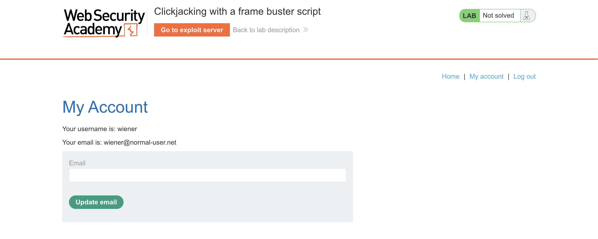
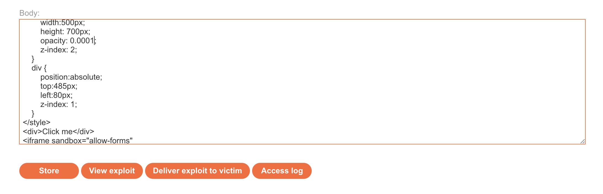
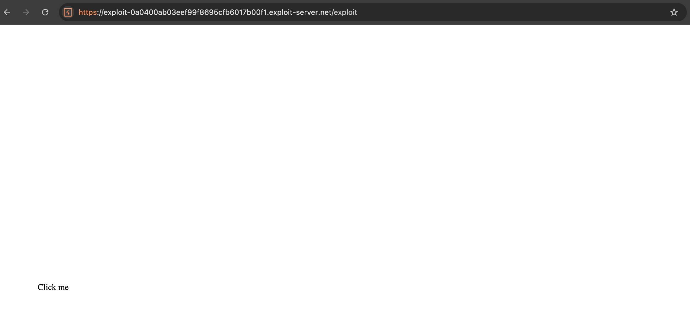
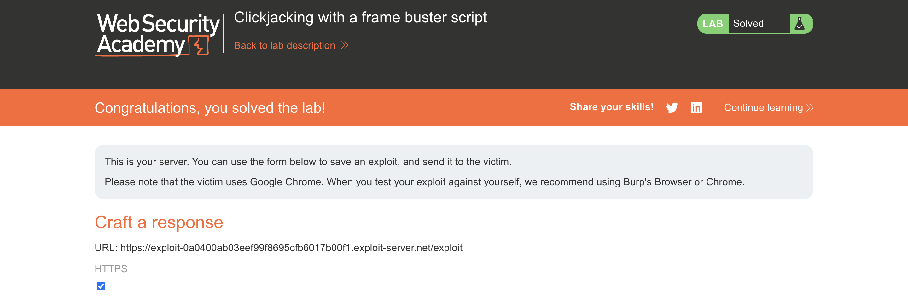

# WEB APPLICATION PENETRATION TEST REPORT: FRAME BUSTER BYPASS

## 1. Document Control

| Detail | Value |
| :--- | :--- |
| **Report Date** | 20 March 2026 |
| **Report Version** | 1.0 |
| **Classification** | CONFIDENTIAL |
| **Prepared By** | Ramil V. Deocariza Jr. |

---

## 2. Executive Summary
This report details the bypass of a client-side frame-busting defense mechanism. By leveraging HTML5 iframe sandbox attributes, an attacker can neutralize the application's JavaScript defenses and successfully execute a Clickjacking attack, leading to forced account modification.

### 2.1 Overall Risk Rating
**Rating: HIGH**

### 2.2 Risk Summary
| Critical | High | Medium | Low | Info | Total Findings |
| :---: | :---: | :---: | :---: | :---: | :---: |
| 0 | 1 | 0 | 0 | 0 | 1 |

---

## 3. Detailed Findings

### VULN-001 — Clickjacking via Client-Side Defense Bypass

| Attribute | Detail |
| :--- | :--- |
| **Severity** | High |
| **Finding ID** | VULN-001 |
| **Affected Endpoint** | `/my-account?email=[parameter]` |
| **CWE** | CWE-1021: Improper Restriction of Rendered UI Layers or Frames |
| **CVSSv3 Score** | 8.1 (High) |
| **OWASP Category**| A01:2021 – Broken Access Control |
| **Status** | Open |

#### 3.1 Description
The application attempts to prevent Clickjacking by implementing a client-side JavaScript "frame buster" (e.g., checking `if (top != self)` and redirecting the parent window). However, client-side defenses are inherently flawed. An attacker can load the application inside an `<iframe>` and apply the HTML5 `sandbox="allow-forms"` attribute. This attribute permits the target form to function but explicitly blocks the execution of the frame-busting JavaScript, leaving the application vulnerable to UI redressing.

#### 3.2 Proof of Concept (PoC)

**1. Identification & Defense Analysis**
Inspected the source code of the target endpoint and identified the client-side frame-busting script relying on `window.top` manipulation.

  
  
<i><b>Figure 1:</b> Observing the client-side frame-busting script in the source code.</i>

**2. Crafting the Sandboxed Overlay**
Constructed the payload on the Exploit Server. Added the `sandbox="allow-forms"` attribute to the iframe. This strictly sandboxes the target site, preventing it from executing the `top.location` breakout script while still allowing the prefilled email update form to be submitted.

  
  
<i><b>Figure 2:</b> Utilizing the HTML5 sandbox attribute to neutralize the JavaScript defense.</i>

**3. Execution & Verification**
Delivered the payload. The frame-busting script failed to execute due to the sandbox restrictions, allowing the victim to unknowingly click the invisible "Update email" button masked by the decoy overlay.

  
  
<i><b>Figure 3:</b> Successful bypass of the frame buster leading to forced email update.</i>

  
  
<i><b>Figure 4:</b> Final confirmation of lab completion.</i>

#### 3.3 Business Impact
Reliance on easily bypassed client-side scripts results in a false sense of security, allowing attackers to execute high-impact account takeover attacks via URL prefilling and UI redressing.

#### 3.4 Remediation
Never rely on client-side JavaScript (frame busters) to prevent Clickjacking. Frame control must be enforced at the protocol level using robust HTTP response headers, specifically `Content-Security-Policy: frame-ancestors 'self'` and `X-Frame-Options: SAMEORIGIN`.

#### 3.5 References
* **CWE-1021:** https://cwe.mitre.org/data/definitions/1021.html
* **OWASP Clickjacking Defense:** https://cheatsheetseries.owasp.org/cheatsheets/Clickjacking_Defense_Cheat_Sheet.html