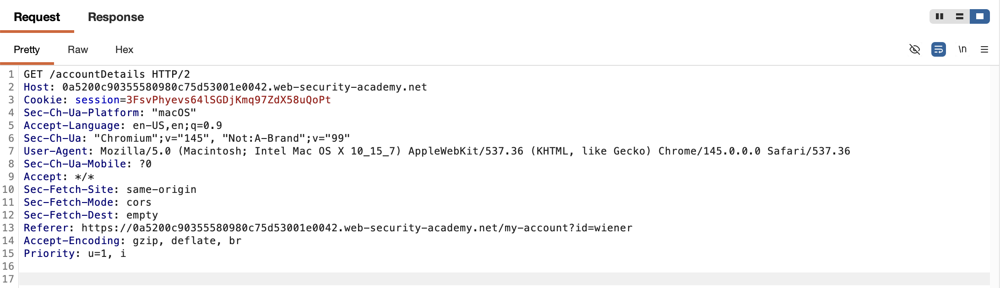
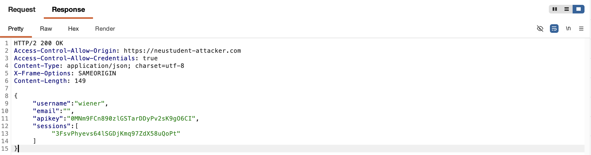
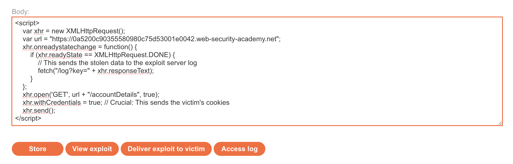
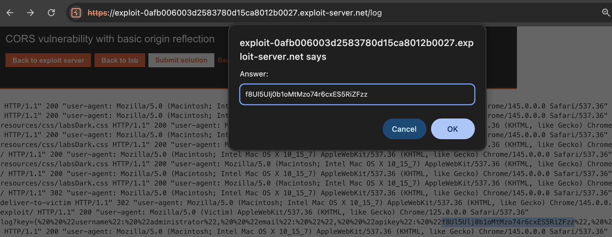
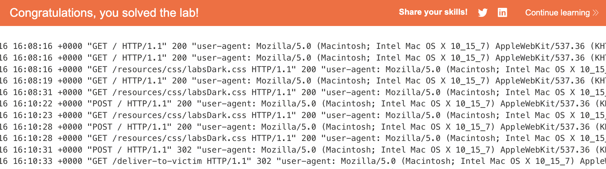

# 🛡️ Lab: CORS vulnerability with basic origin reflection

> **Category:** `Cross-Origin Resource Sharing (CORS)`  
> **Difficulty:** `Apprentice`  
> **Status:** `Completed` ✅

---

### 🎯 Objective
The objective of this lab is to exploit a CORS misconfiguration where the server blindly trusts any `Origin` header. By delivering a malicious script to an administrator, I can exfiltrate their private API key from the `/accountDetails` endpoint.

### 🛠️ Exploit Strategy
* **Vulnerability Point:** `/accountDetails` endpoint.
* **Payload Type:** CORS Misconfiguration (Origin Reflection).
* **Technical Logic:** The application identifies the `Origin` of a request and reflects it in the `Access-Control-Allow-Origin` header while setting `Access-Control-Allow-Credentials: true`. This combination allows a third-party script to perform an authenticated request (using the victim's session cookies) and read the sensitive JSON response.

---

### 📑 Technical Walkthrough

#### 1. Identification & Analysis
I analyzed the traffic for the `/accountDetails` endpoint. I noticed that the server returns sensitive user information and includes CORS headers, indicating it might be susceptible to cross-origin attacks.

  
  
<i><b>Figure 1:</b> Intercepting the account details API request.</i>

#### 2. Proving Origin Reflection
Using **Burp Repeater**, I injected a fake `Origin` header. The server responded by mirroring my fake origin back in its access control headers. This confirms that the server has no whitelist and trusts any domain that asks.

  
  
<i><b>Figure 2:</b> Burp Suite evidence of the server reflecting an untrusted Origin.</i>

#### 3. Crafting the Exfiltration Script
I used the **Exploit Server** to host a JavaScript payload. The script uses `XMLHttpRequest` with `withCredentials = true` to fetch the admin's details and then redirects the data to my exploit server's log via a query parameter.

  
  
<i><b>Figure 3:</b> The malicious XHR script designed to steal the API key.</i>

#### 4. Execution & Log Analysis
After delivering the exploit to the victim, I checked the **Access Log**. I successfully retrieved the administrator's API key, which was appended to the log request by my script.

  
  
<i><b>Figure 4:</b> Successfully exfiltrating the admin API key into the exploit log.</i>

#### 5. Final Confirmation
I submitted the stolen API key to the lab, resulting in a successful solve.

  
  
<i><b>Figure 5:</b> Final confirmation of the solved CORS lab.</i>

---

### 🧠 Key Takeaway
Trusting the `Origin` header without validation is equivalent to having no security policy at all. It allows any malicious site to act as a "proxy" to steal your users' authenticated data.

**Remediation:** Do not reflect the `Origin` header. Instead, compare the incoming origin against a **whitelist** of trusted domains. If the origin is not in the whitelist, the server should deny the CORS request.

---