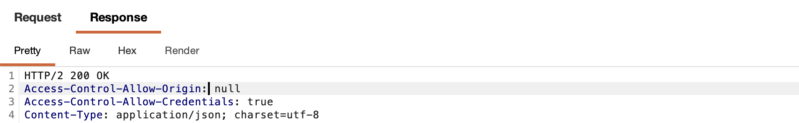
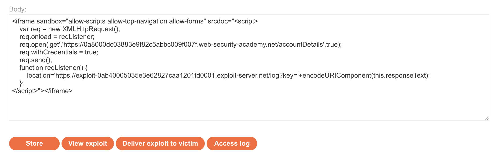
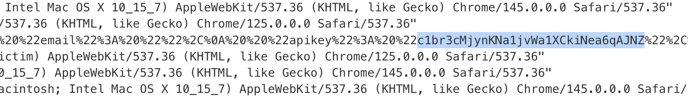
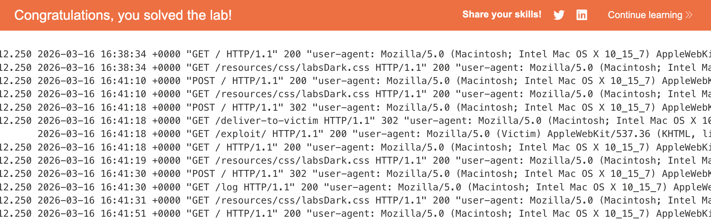

# WEB APPLICATION PENETRATION TEST REPORT: CORS MISCONFIGURATION (NULL ORIGIN)

## 1. Document Control

| Detail | Value |
| :--- | :--- |
| **Report Date** | 16 March 2026 |
| **Report Version** | 1.0 |
| **Classification** | CONFIDENTIAL |
| **Prepared By** | Ramil V. Deocariza Jr. |

---

## 2. Executive Summary
This assessment identified a High-severity Cross-Origin Resource Sharing (CORS) vulnerability. The application explicitly trusts the `null` origin, allowing attackers to exfiltrate sensitive data using sandboxed iframes.

### 2.1 Overall Risk Rating
**Rating: HIGH**

### 2.2 Risk Summary
| Critical | High | Medium | Low | Info | Total Findings |
| :---: | :---: | :---: | :---: | :---: | :---: |
| 0 | 1 | 0 | 0 | 0 | 1 |

---

## 3. Detailed Findings

### VULN-001 — CORS Policy Trusts Null Origin

| Attribute | Detail |
| :--- | :--- |
| **Severity** | High |
| **Finding ID** | VULN-001 |
| **Affected URL** | `/accountDetails` |
| **CWE** | CWE-942: Permissive Cross-domain Policy with Untrusted Domains |
| **CVSSv3 Score** | 8.1 (High) |
| **OWASP Category**| A05:2021 – Security Misconfiguration |
| **Status** | Open |

#### 3.1 Description
The server's CORS policy explicitly whitelists the `null` origin while allowing credentials. An attacker can force a browser to send a request with an `Origin: null` header by embedding their malicious exfiltration script inside a sandboxed `<iframe>` that lacks the `allow-same-origin` attribute, bypassing intended access controls.

#### 3.2 Proof of Concept (PoC)

**1. Identification & Repeater Analysis**
Injected an `Origin: null` header in Burp Repeater. The server reflected this origin and confirmed credential support.

  
  
<i><b>Figure 1:</b> Proving the server trusts and reflects the 'null' origin.</i>

**2. Crafting the Sandboxed Exploit**
Configured the exploit server to host a sandboxed iframe to trigger the browser's `null` origin generation while executing the XHR exfiltration script.

  
  
<i><b>Figure 2:</b> The sandboxed iframe payload used to spoof the null origin.</i>

**3. Execution & Verification**
The victim accessed the exploit, and their API key was successfully leaked to the attacker's server logs.

  
  
<i><b>Figure 3:</b> Retrieving the administrator's stolen API key from the logs.</i>

  
  
<i><b>Figure 4:</b> Lab solved confirmation.</i>

#### 3.3 Business Impact
Bypassing the Same-Origin Policy via `null` spoofing allows attackers to steal session-specific sensitive data, leading to full account compromise.

#### 3.4 Remediation
Remove `null` from the CORS whitelist. Only explicitly defined, fully qualified domain names belonging to trusted entities should be allowed in the `Access-Control-Allow-Origin` header when credentials are required.

#### 3.5 References
* **CWE-942:** https://cwe.mitre.org/data/definitions/942.html
* **MDN CORS Documentation:** https://developer.mozilla.org/en-US/docs/Web/HTTP/CORS