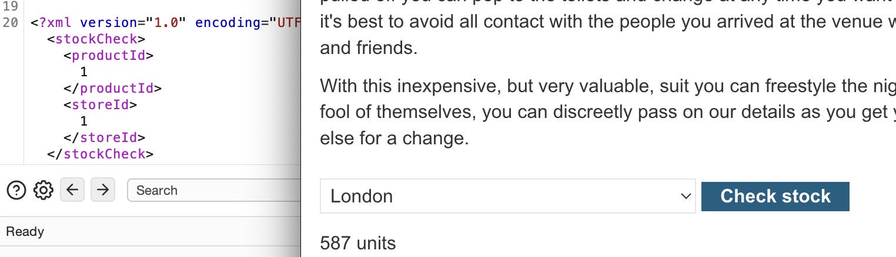
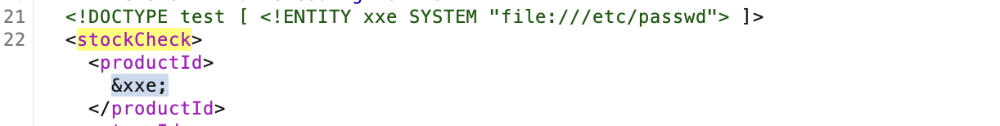
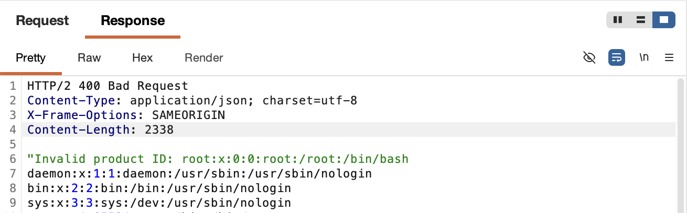

# WEB APPLICATION PENETRATION TEST REPORT: XXE (FILE RETRIEVAL)

## 1. Document Control

| Detail | Value |
| :--- | :--- |
| **Report Date** | 16 March 2026 |
| **Report Version** | 1.0 |
| **Classification** | CONFIDENTIAL |
| **Prepared By** | Ramil V. Deocariza Jr. |

---

## 2. Executive Summary
This report details the exploitation of an XML External Entity (XXE) injection vulnerability. The application's backend XML parser insecurely processes external entities, leading to unauthorized local file disclosure.

### 2.1 Overall Risk Rating
**Rating: HIGH**

### 2.2 Risk Summary
| Critical | High | Medium | Low | Info | Total Findings |
| :---: | :---: | :---: | :---: | :---: | :---: |
| 0 | 1 | 0 | 0 | 0 | 1 |

---

## 3. Detailed Findings

### VULN-001 — XXE Injection Allowing Local File Read

| Attribute | Detail |
| :--- | :--- |
| **Severity** | High |
| **Finding ID** | VULN-001 |
| **Affected Component** | "Check stock" functionality (XML Parser) |
| **CWE** | CWE-611: Improper Restriction of XML External Entity Reference |
| **CVSSv3 Score** | 7.5 (High) |
| **OWASP Category**| A05:2021 – Security Misconfiguration |
| **Status** | Open |

#### 3.1 Description
The application's "Check stock" feature accepts XML input. The backend parser is misconfigured to allow Document Type Definitions (DTDs) and the resolution of external entities. By defining a custom external entity (`SYSTEM`) pointing to a local file path (`file:///etc/passwd`), an attacker can force the parser to read the file and reflect its contents in the HTTP response.

#### 3.2 Proof of Concept (PoC)

**1. Identification & Interception**
Intercepted the stock check request and identified the XML data structure.

  
  
<i><b>Figure 1:</b> Intercepting the standard XML stock check request.</i>

**2. Crafting the XXE Payload**
Injected a `DOCTYPE` definition into the request, creating an entity named `xxe` linked to the server's `/etc/passwd` file, and referenced the entity within the XML body.

  
  
<i><b>Figure 2:</b> Injecting the DTD and referencing the external entity.</i>

**3. Execution & Verification**
The parser resolved the entity and reflected the contents of the `passwd` file within the application's error response.

  
  
<i><b>Figure 3:</b> Successfully retrieving the contents of /etc/passwd.</i>

  
  
<i><b>Figure 4:</b> Lab solve confirmation.</i>

#### 3.3 Business Impact
Arbitrary file read vulnerabilities allow attackers to exfiltrate sensitive configuration files, source code, passwords, and environmental variables, severely compromising the confidentiality of the server.

#### 3.4 Remediation
Disable the resolution of external entities and support for `DOCTYPE` declarations in all XML parsers utilized by the application. If possible, consider migrating from XML to JSON data formats.

#### 3.5 References
* **CWE-611:** https://cwe.mitre.org/data/definitions/611.html
* **OWASP XXE Prevention Cheat Sheet:** https://cheatsheetseries.owasp.org/cheatsheets/XML_External_Entity_Prevention_Cheat_Sheet.html