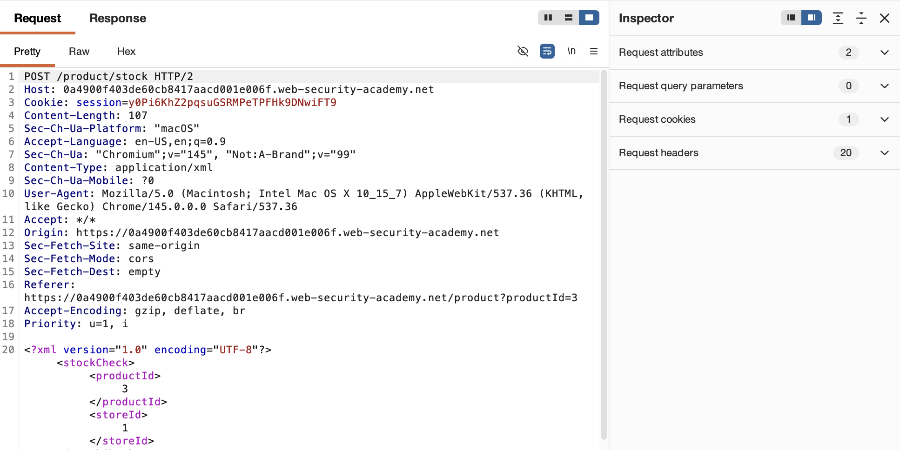
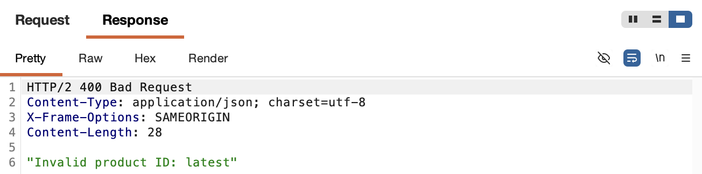
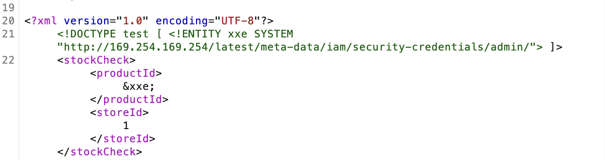
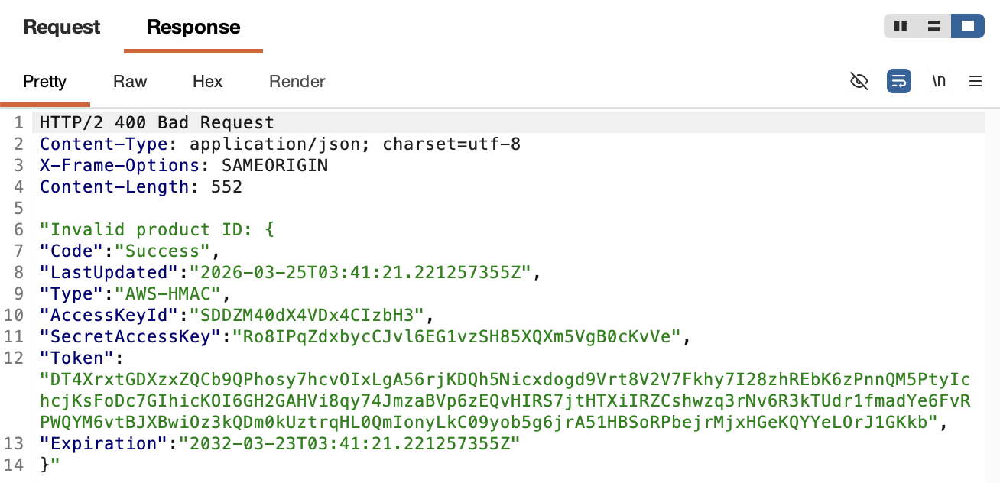

# 🛡️ Lab: Exploiting XXE to perform SSRF attacks

> **Category:** `XML External Entity (XXE) Injection`  
> **Difficulty:** `Apprentice`  
> **Status:** `Completed` ✅

---

### 🎯 Objective
The objective of this lab is to exploit an XXE vulnerability to perform an SSRF attack against an internal EC2 metadata endpoint (`http://169.254.169.254/`) to retrieve sensitive IAM security credentials.

### 🛠️ Exploit Strategy
* **Vulnerability Point:** Product "Check stock" feature (XML parser).
* **Payload Type:** XXE-based SSRF.
* **Technical Logic:** By defining an external entity that points to a URL instead of a local file, I can force the server-side XML parser to make a request to internal resources. I used this to "crawl" the internal AWS metadata service until I reached the IAM credentials for the `admin` role.

---

### 📑 Technical Walkthrough

#### 1. Identification
I intercepted the "Check stock" POST request in **Burp Proxy**. I identified that the data is transmitted as XML, which provides the entry point for injecting a malicious DTD.

  
  
<i><b>Figure 1:</b> Intercepting the baseline XML request.</i>

#### 2. Initial SSRF Discovery
In **Burp Repeater**, I injected a `SYSTEM` entity targeting the base metadata URL. The server responded with a directory/ID name, confirming that the XML parser is resolving external URLs and reflecting the output.

  
  
<i><b>Figure 2:</b> Probing the internal network via the XML parser.</i>

#### 3. Intermediate Path Traversal
By iteratively updating the DTD URL with the values returned in the responses (e.g., `379`, `latest`, `meta-data`), I successfully navigated the API tree until I reached the `security-credentials/admin` endpoint.

  
  
<i><b>Figure 3:</b> Evidence of manual traversal to the admin credentials folder.</i>

#### 4. Data Exfiltration (The Loot)
Targeting the final `admin` endpoint returned a JSON object containing the `SecretAccessKey`. This successfully exfiltrated internal cloud credentials to an external attacker-controlled session.

  
  
<i><b>Figure 4:</b> Successfully retrieving the IAM SecretAccessKey.</i>

#### 5. Final Confirmation
The retrieval of the credentials satisfied the lab requirements and triggered the completion banner.

  
  
<i><b>Figure 5:</b> Lab solved confirmation.</i>

---

### 🧠 Key Takeaway
XXE is a versatile vulnerability that can be used to pivot from a simple web form into a cloud provider's internal infrastructure.

**Remediation:** Disable DTDs and external entity resolution in all XML processing libraries.
---