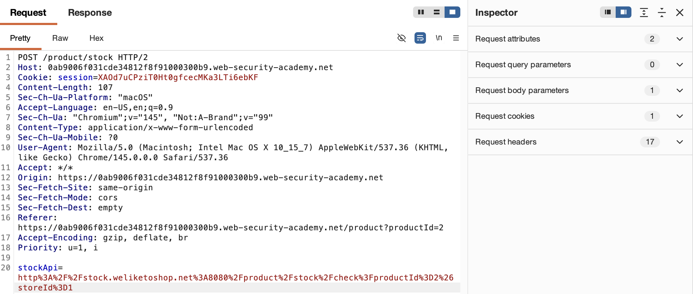
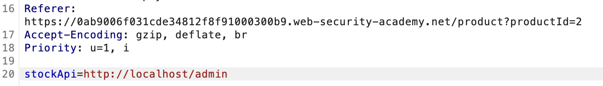
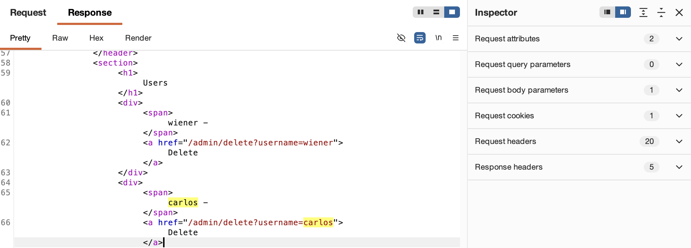
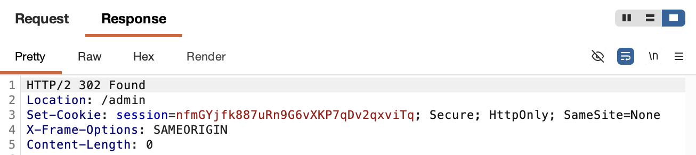
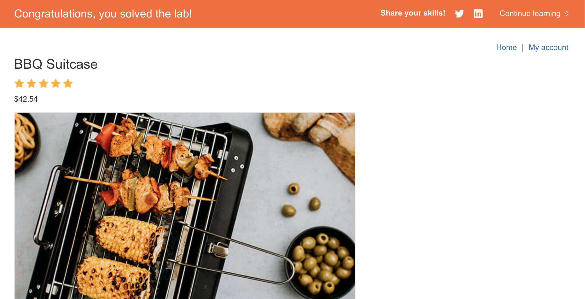

# WEB APPLICATION PENETRATION TEST REPORT: SERVER-SIDE REQUEST FORGERY (LOCALHOST)

## 1. Document Control

| Detail | Value |
| :--- | :--- |
| **Report Date** | 17 March 2026 |
| **Report Version** | 1.0 |
| **Classification** | CONFIDENTIAL |
| **Prepared By** | Ramil V. Deocariza Jr. |

---

## 2. Executive Summary
This report details the exploitation of a Server-Side Request Forgery (SSRF) vulnerability. The application allows an attacker to manipulate server-side HTTP requests to access an internal administrative interface, leading to unauthorized data modification (user deletion).

### 2.1 Overall Risk Rating
**Rating: HIGH**

### 2.2 Risk Summary
| Critical | High | Medium | Low | Info | Total Findings |
| :---: | :---: | :---: | :---: | :---: | :---: |
| 0 | 1 | 0 | 0 | 0 | 1 |

---

## 3. Detailed Findings

### VULN-001 — SSRF Bypassing Access Controls via Localhost

| Attribute | Detail |
| :--- | :--- |
| **Severity** | High |
| **Finding ID** | VULN-001 |
| **Affected URL** | `/product/stock` (`stockApi` parameter) |
| **CWE** | CWE-918: Server-Side Request Forgery (SSRF) |
| **CVSSv3 Score** | 8.5 (High) |
| **OWASP Category**| A10:2021 – Server-Side Request Forgery (SSRF) |
| **Status** | Open |

#### 3.1 Description
The application utilizes a `stockApi` parameter to fetch data from an internal service. Because the application fails to validate the destination URL provided by the user, an attacker can specify `http://localhost/admin`. The server processes this request, and since the request originates from the server's own IP address, it bypasses external access controls, exposing the administrative dashboard.

#### 3.2 Proof of Concept (PoC)

**1. Identification**
Intercepted the stock check request and noticed the `stockApi` parameter containing a URL to an internal service.

  
  
<i><b>Figure 1:</b> Intercepting the baseline request containing the vulnerable stockApi parameter.</i>

**2. Probing the Admin Interface**
Changed the parameter to `http://localhost/admin` to force the server to fetch its own administrative dashboard.

  
  
<i><b>Figure 2:</b> Bypassing access controls to view the internal admin panel.</i>

**3. Analyzing Administrative Actions**
Inspected the source code of the returned admin panel to identify the endpoint required to delete a user.

  
  
<i><b>Figure 3:</b> Discovering the user deletion endpoint for 'carlos'.</i>

**4. Execution of the SSRF Attack**
Updated the `stockApi` parameter to target the deletion endpoint, which the server processed as a trusted internal action.

  
  
<i><b>Figure 4:</b> Triggering the deletion of the 'carlos' user via SSRF.</i>

  
  
<i><b>Figure 5:</b> Final confirmation of lab completion.</i>

#### 3.3 Business Impact
Allows an attacker to bypass network perimeters to access internal administrative tools, leading to unauthorized actions such as privilege escalation, data destruction, and full application compromise.

#### 3.4 Remediation
Implement a strict **whitelist** of allowed hostnames or IP addresses for any outbound server requests. Never pass raw, user-supplied URLs directly to HTTP client libraries. 

#### 3.5 References
* **CWE-918:** https://cwe.mitre.org/data/definitions/918.html
* **OWASP SSRF Prevention:** https://cheatsheetseries.owasp.org/cheatsheets/Server_Side_Request_Forgery_Prevention_Cheat_Sheet.html