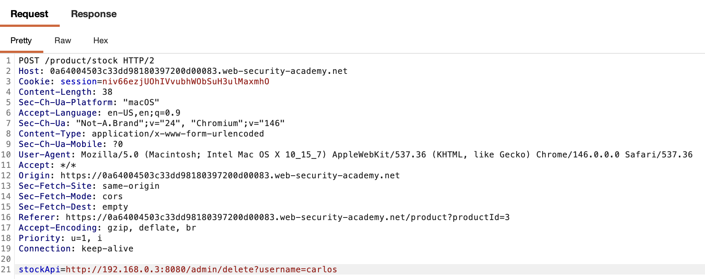
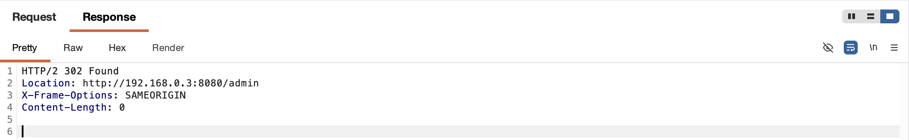

# WEB APPLICATION PENETRATION TEST REPORT: SSRF (INTERNAL NETWORK SCANNING)

## 1. Document Control

| Detail | Value |
| :--- | :--- |
| **Report Date** | 17 March 2026 |
| **Report Version** | 1.0 |
| **Classification** | CONFIDENTIAL |
| **Prepared By** | Ramil V. Deocariza Jr. |

---

## 2. Executive Summary
This report outlines the exploitation of a Server-Side Request Forgery (SSRF) vulnerability. The flaw was weaponized to perform an internal network scan, revealing a hidden administrative backend service which was subsequently used to execute unauthorized commands.

### 2.1 Overall Risk Rating
**Rating: HIGH**

### 2.2 Risk Summary
| Critical | High | Medium | Low | Info | Total Findings |
| :---: | :---: | :---: | :---: | :---: | :---: |
| 0 | 1 | 0 | 0 | 0 | 1 |

---

## 3. Detailed Findings

### VULN-001 — SSRF Allowing Internal Network Brute-forcing

| Attribute | Detail |
| :--- | :--- |
| **Severity** | High |
| **Finding ID** | VULN-001 |
| **Affected URL** | `/product/stock` (`stockApi` parameter) |
| **CWE** | CWE-918: Server-Side Request Forgery (SSRF) |
| **CVSSv3 Score** | 8.5 (High) |
| **OWASP Category**| A10:2021 – Server-Side Request Forgery (SSRF) |
| **Status** | Open |

#### 3.1 Description
The server-side code fetches data from a URL provided in the `stockApi` parameter. Because there are no restrictions on the destination IP, an attacker can use Burp Intruder to iterate through internal subnets (e.g., `192.168.0.X:8080`) to discover responsive internal hosts. Trusting the request's local origin, the backend system permits administrative actions without authentication.

#### 3.2 Proof of Concept (PoC)

**1. Identification**
Intercepted the stock request, identifying the `stockApi` parameter as a potential SSRF vector targeting the internal network.

  
  
<i><b>Figure 1:</b> Capturing the baseline request with the vulnerable stockApi parameter.</i>

**2. Internal Network Scanning**
Used Burp Intruder to perform a horizontal scan of the `192.168.0.0/24` subnet, revealing an active host at `192.168.0.3:8080` returning a `200 OK`.

  
  
<i><b>Figure 2:</b> Identifying the hidden admin interface via Intruder.</i>

**3. Crafting the Administrative Payload**
Updated the `stockApi` URL in Repeater to target the specific deletion endpoint for the user `carlos` on the discovered internal host.

  
  
<i><b>Figure 3:</b> Constructing the SSRF payload to trigger deletion.</i>

**4. Execution & Verification**
The server responded with a `302 Found`, confirming the internal backend successfully processed the deletion redirect.

  
  
<i><b>Figure 4:</b> The server's 302 response confirming the command execution.</i>

  
  
<i><b>Figure 5:</b> Successful lab completion banner.</i>

#### 3.3 Business Impact
Allows attackers to map internal infrastructure, identify unpatched legacy systems, and exploit internal microservices that lack external authentication (Zero Trust violations).

#### 3.4 Remediation
Applications must not accept arbitrary URLs from the client. Use hardcoded internal references or a strict whitelist. Internal services should mandate authentication and authorization regardless of whether the request originates from the local network.

#### 3.5 References
* **CWE-918:** https://cwe.mitre.org/data/definitions/918.html
* **OWASP SSRF Prevention:** https://cheatsheetseries.owasp.org/cheatsheets/Server_Side_Request_Forgery_Prevention_Cheat_Sheet.html