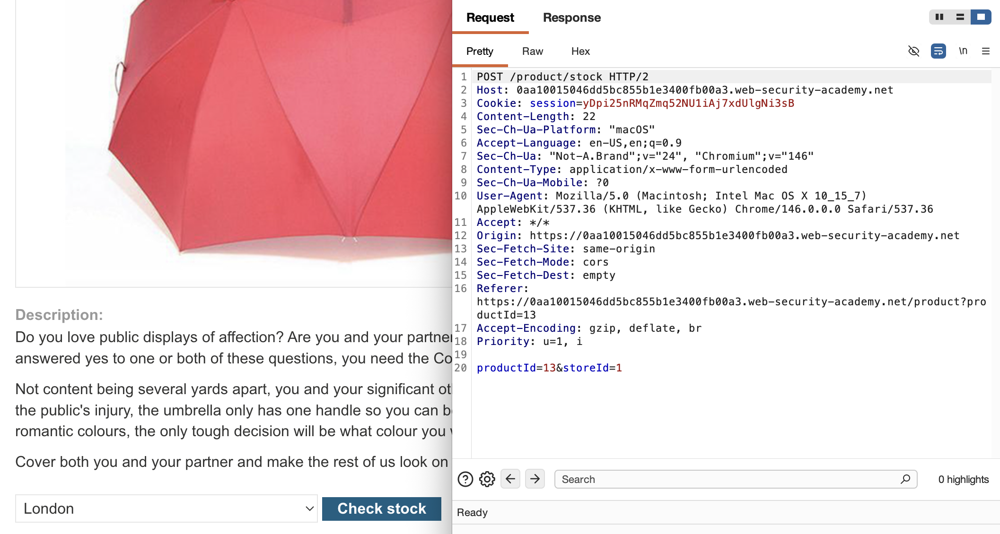
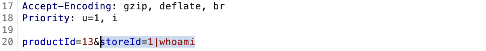
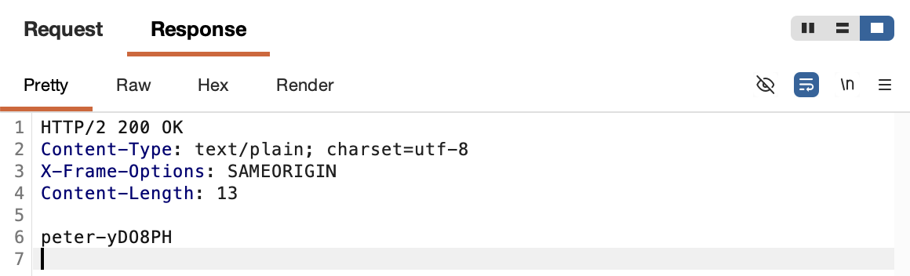
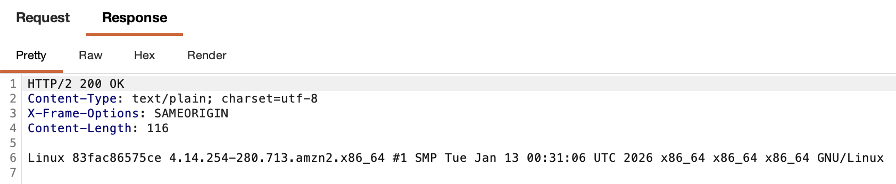
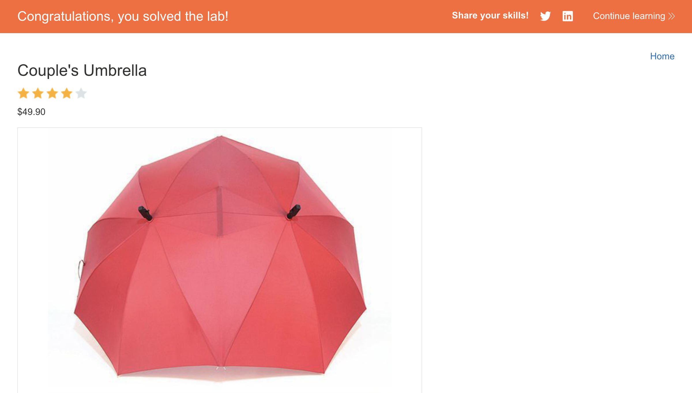

# 🛡️ Lab: OS command injection, simple case

> **Category:** `OS Command Injection`  
> **Difficulty:** `Apprentice`  
> **Status:** `Completed` ✅

---

### 🎯 Objective
The objective of this lab is to exploit an OS command injection vulnerability in the product stock checker to execute the `whoami` command and identify the user context under which the application is running.

### 🛠️ Exploit Strategy
* **Vulnerability Point:** `storeId` parameter in the stock check feature.
* **Payload Type:** Command Injection via shell metacharacters (`|`).
* **Technical Logic:** The application passes user-supplied input directly into a system shell command. By appending a pipe operator (`|`), I can chain an additional command to the original execution. The server executes my injected `whoami` command and returns the standard output (stdout) directly in the HTTP response.

---

### 📑 Technical Walkthrough

#### 1. Identification
I intercepted the stock check request and identified that the `storeId` and `productId` are passed to the backend, likely as arguments to a server-side script or binary.

  
  
<i><b>Figure 1:</b> Intercepting the baseline stock check request.</i>

#### 2. Injecting the Command
In **Burp Repeater**, I appended the pipe operator followed by the `whoami` command to the `storeId` parameter. This tells the underlying shell to execute the stock check and then immediately execute my command.

  
  
<i><b>Figure 2:</b> Injecting the command separator and the 'whoami' command.</i>

#### 3. Command Execution Results
The server processed the request and returned the raw output of the `whoami` command in the response body, revealing the operating system username.

  
  
<i><b>Figure 3:</b> Observing the successfully executed command output in the response.</i>

#### 4. Verification of System Access
I verified the extent of the injection by observing how the application handles the output. The fact that the output is rendered directly indicates an "in-band" or "classic" command injection.

  
  
<i><b>Figure 4:</b> Analyzing the reflected output from the server.</i>

#### 5. Final Confirmation
The execution of the `whoami` command satisfied the lab's requirements.

  
  
<i><b>Figure 5:</b> Final confirmation of lab completion.</i>

---

### 🧠 Key Takeaway
Command injection is often the result of using functions like `exec()`, `system()`, or `passthru()` in PHP, or `child_process.exec()` in Node.js, without sanitizing user input. It provides an attacker with a foothold on the server.

**Remediation:** Never pass raw user input to OS commands. Use built-in API functions that don't involve the shell, or implement a strict whitelist of allowed characters and values.

---