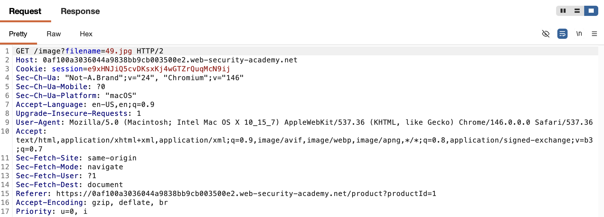
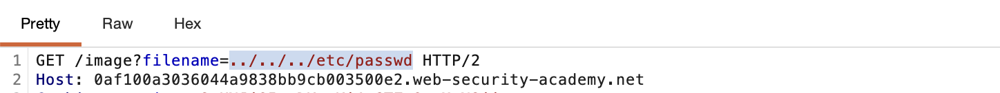
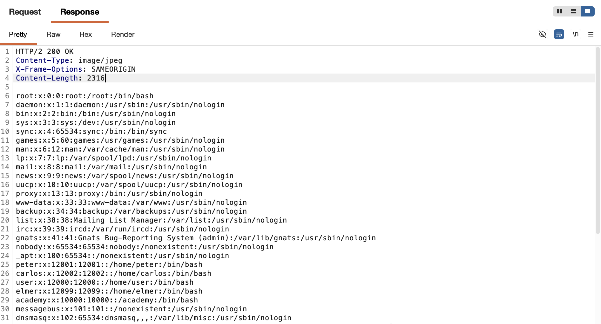
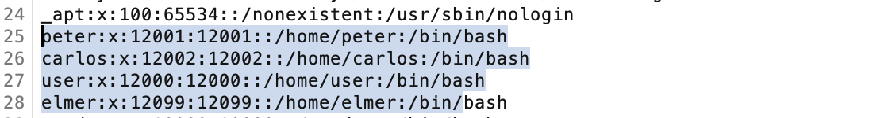

# WEB APPLICATION PENETRATION TEST REPORT: FILE PATH TRAVERSAL

## 1. Document Control

| Detail | Value |
| :--- | :--- |
| **Report Date** | 17 March 2026 |
| **Report Version** | 1.0 |
| **Classification** | CONFIDENTIAL |
| **Prepared By** | Ramil V. Deocariza Jr. |

---

## 2. Executive Summary
This report highlights the discovery of a Path Traversal vulnerability. The application fails to sanitize file requests, permitting an attacker to escape the web root directory and exfiltrate highly sensitive OS-level configuration files.

### 2.1 Overall Risk Rating
**Rating: HIGH**

### 2.2 Risk Summary
| Critical | High | Medium | Low | Info | Total Findings |
| :---: | :---: | :---: | :---: | :---: | :---: |
| 0 | 1 | 0 | 0 | 0 | 1 |

---

## 3. Detailed Findings

### VULN-001 — Arbitrary File Read via Path Traversal

| Attribute | Detail |
| :--- | :--- |
| **Severity** | High |
| **Finding ID** | VULN-001 |
| **Affected URL** | `/image` (`filename` parameter) |
| **CWE** | CWE-22: Improper Limitation of a Pathname to a Restricted Directory |
| **CVSSv3 Score** | 7.5 (High) |
| **OWASP Category**| A01:2021 – Broken Access Control |
| **Status** | Open |

#### 3.1 Description
The application utilizes a `filename` parameter to serve images from the filesystem. Because the application does not strip directory traversal sequences, an attacker can provide the payload `../../../etc/passwd`. This instructs the underlying OS API to navigate up to the root directory and read arbitrary system files.

#### 3.2 Proof of Concept (PoC)

**1. Identification**
Identified the dynamic parameter responsible for fetching product images from the server.

  
  
<i><b>Figure 1:</b> Identifying the image-loading request in Burp Suite.</i>

**2. Injecting the Traversal Payload**
Modified the parameter in Burp Repeater, replacing the image filename with a dot-dot-slash relative path traversal sequence.

  
  
<i><b>Figure 2:</b> Injecting the dot-dot-slash sequence.</i>

**3. Data Exfiltration & Verification**
The server resolved the path and returned the raw contents of the `/etc/passwd` file in the HTTP response body.

  
  
<i><b>Figure 3:</b> Successfully reading sensitive system files via the web interface.</i>

  
  
<i><b>Figure 4:</b> Detailed view of the exfiltrated user data.</i>

  
  
<i><b>Figure 5:</b> Final confirmation of lab completion.</i>

#### 3.3 Business Impact
Attackers can retrieve sensitive system files, source code, hardcoded credentials, API keys, and environment variables, leading to further systemic compromise.

#### 3.4 Remediation
Avoid passing user input directly to filesystem APIs. If dynamic file loading is required, use an indirect object reference (like a database ID) or strictly validate the input against an exact whitelist of permitted filenames, ensuring no path metacharacters (e.g., `../` or `/`) are processed.

#### 3.5 References
* **CWE-22:** https://cwe.mitre.org/data/definitions/22.html
* **OWASP Path Traversal Prevention:** https://owasp.org/www-community/attacks/Path_Traversal