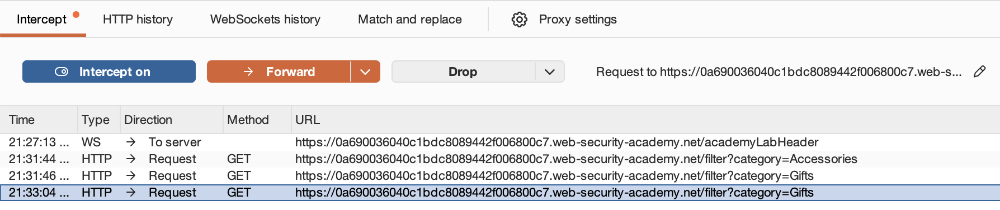
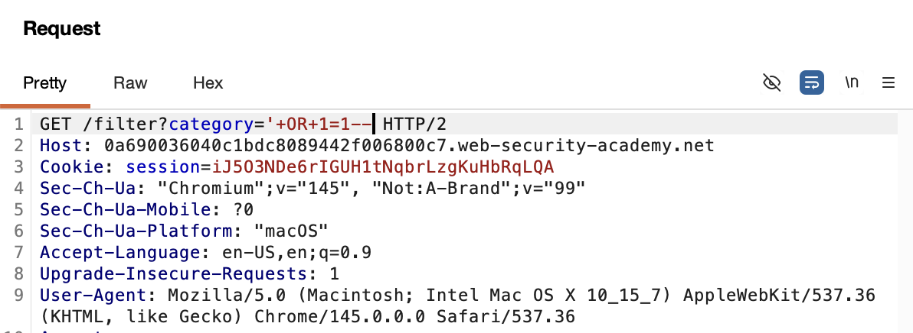

# 🛡️ Lab: Lab: SQL injection vulnerability in WHERE clause allowing retrieval of hidden data

> **Category:** `SQL Injection`  
> **Difficulty:** `Apprentice`  
> **Status:** `Completed` ✅

---

### 🎯 Objective
The objective of this lab is to exploit a **SQL Injection (SQLi)** vulnerability in the product category filter. By manipulating the query logic, I aim to bypass the application's hidden filter (`released = 1`) to reveal unreleased products.

### 🛠️ Exploit Strategy
* **Vulnerability Point:** Product category filter (`category` parameter)
* **Payload Type:** Logic Bypass / Boolean-based Injection
* **Technical Logic:** The original query: `SELECT * FROM products WHERE category = 'Gifts' AND released = 1`  
    The injected query: `SELECT * FROM products WHERE category = 'Gifts'+OR+1=1-- AND released = 1`

---

### 📑 Technical Walkthrough

#### 1. Identification & Reconnaissance
I accessed the shop and identified that filtering by product category triggers a `GET` request. In the browser, this manifests as a URL parameter: `/filter?category=[CategoryName]`.

  
  
<i><b>Figure 1:</b> Initial shop page identifying the category filter as the attack vector.</i>

#### 2. Interception and Analysis
Using **Burp Suite Proxy**, I intercepted the request for the "Lifestyle" category. I analyzed the raw HTTP request to ensure there was no client-side encoding or protection that would interfere with the payload.

  
  
<i><b>Figure 2:</b> Intercepted GET request in Burp Suite Proxy.</i>

#### 3. Exploitation (Crafting the Request)
I sent the request to **Burp Repeater**. I modified the `category` value to `'+OR+1=1--`. The `'` closes the string, `OR 1=1` makes the condition always true, and `--` comments out the rest of the query.

  
  
<i><b>Figure 3:</b> Crafting the malicious SQLi payload in Burp Repeater.</i>

#### 4. Server Response Analysis
Upon sending the modified request, the server returned a `200 OK` response. The response body contained items that were not visible during the initial reconnaissance phase.

  
  
<i><b>Figure 4:</b> Observing the modified server response containing hidden data.</i>

#### 5. Final Verification
I applied the payload directly to the URL in the browser. The page successfully rendered both released and unreleased products, and the "Congratulations" banner confirmed the lab was solved.

  
  
<i><b>Figure 5:</b> Final confirmation of lab completion.</i>

---

### 🧠 Key Takeaway
This vulnerability occurs because user-supplied input is **concatenated** directly into the SQL query string. This allows the input to "break out" of the data context and enter the command context. 

**Remediation:** Developers must use **Parameterized Queries (Prepared Statements)** to ensure that the database treats all user input as literal data rather than executable SQL code.